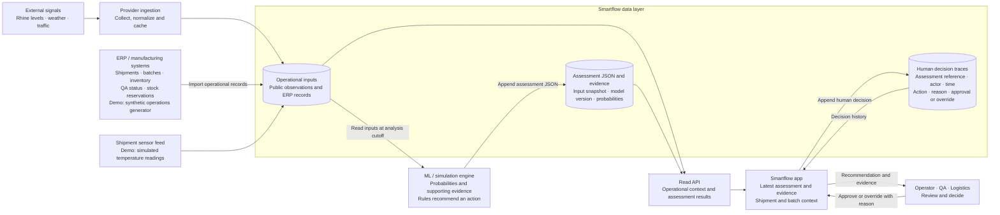
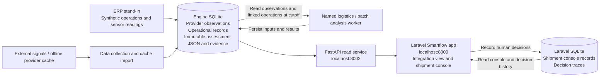

# Smartflow data flow

Slide-ready colour diagram: [PNG, 3200 × 1800](slides/smartflow-data-flow.png) · [editable SVG, 16:9](slides/smartflow-data-flow.svg). The visual shows the product flow; its footer identifies the separate demo databases and batch-linked work still being integrated.

Shipment and manufacturing records enter from an ERP source; public signals enter through provider ingestion. The analysis worker reads stored inputs and writes versioned JSON assessments and evidence. Smartflow displays assessments alongside operational records. People approve or override recommendations, and the app stores their decision traces.

## Product flow

The ERP box represents the intended business-system input. In the demo, a synthetic operations generator supplies linked shipments, batches, inventory, QA status and reservations. Simulated sensor readings represent a separate shipment telemetry feed. There is no live ERP connection yet.

Latest means the newest applicable assessment for the selected shipment or batch at the displayed cutoff, with its model version and evidence retained. A newer assessment must not change a previously recorded decision's assessment reference. The engine supplies probabilities and recommendations; a person records the decision.

## Current local implementation

The two SQLite databases are separate physical stores. Laravel reads the engine through HTTP and manages its own tables; its migrations must not target the engine database. The integration view lists three named logistics scenario assessments and operational dataset counts. The [batch worker and API](BATCH_ASSESSMENTS.md) serve linked immutable results in `/integration/batches`: Laravel fetches the stored list and selected batch's latest record; Vue formats the generated contract without recomputing decisions. Production reservations, incoming shipment timing and sampled product-temperature/QA evidence have separate cards. The existing shipment console reads Laravel records and writes its decision traces there; the batch view is read-only. The [named-scenario decision step](INTEGRATION_DECISIONS.md) separately records human choices by external Python assessment hash in Laravel, without shipment-console linkage or writes to the engine database.

The [ML brief](implementation-ml.md) adds batch-linked assessments using stored operational inputs. The [Laravel brief](implementation-laravel.md) adds linked operational imports, batch views, latest applicable assessment display and decisions tied to assessment evidence. These complete the product flow above without combining the databases.
